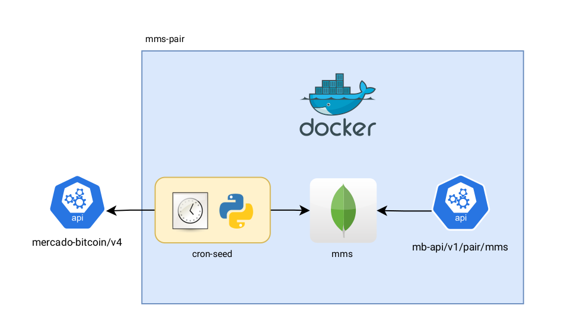
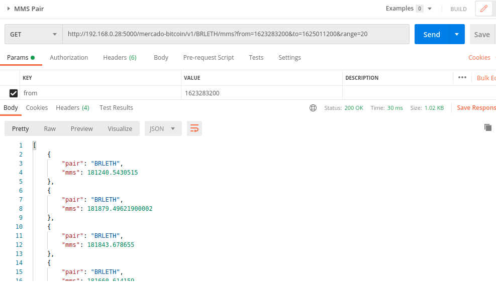

# mb-test-api

Esse teste foi solicitado como desafio para avaliar a capacidade técnica para atuar no time de desenvolvimento do Mercado Bitcoin.

O objetivo consiste em disponibilizar um serviço que expõe variações de médias móveis simples: 20, 50 e 200 dias das moedas Bitcoin e Etherium que são listadas no Mercado Bitcoin.

Arquitetura proposta

## To Run locally:

- Create environment
~~~
virtualenv venv
~~~
- Activate Environment
~~~
source venv/bin/activate
~~~
- Environment Setup:
~~~
pipenv install
~~~

- BEFORE up api service:
  
.1
~~~
docker-compose up mongodb -d
~~~

.2
~~~
python seed.py
~~~

- AFTER

~~~
python app.py
~~~

## Using Docker

~~~
docker-compose up -d 
~~~

# Requests

Health-check
~~~
curl --location --request GET 'http://0.0.0.0:5000/mercado-bitcoin/v1/health-check'
~~~

Example

~~~
curl --location --request GET 'http://192.168.0.28:5000/mercado-bitcoin/v1/BRLETH/mms?from=1623283200&to=1625011200&range=20'
~~~

